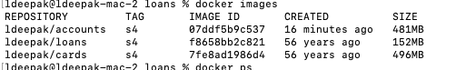
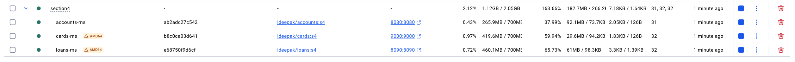
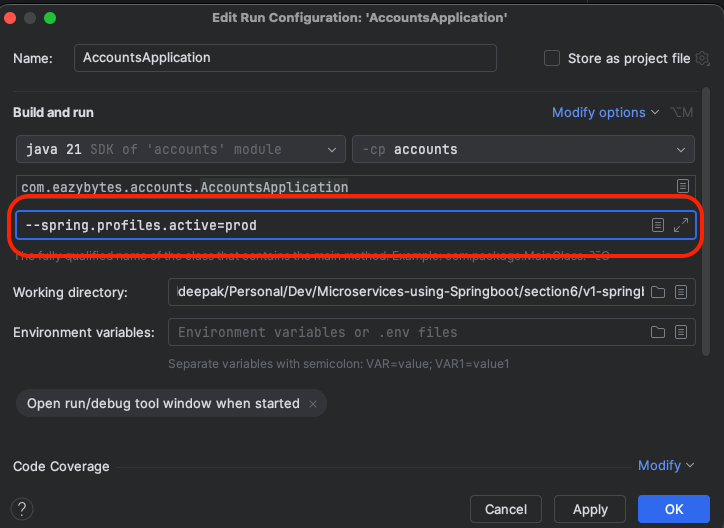
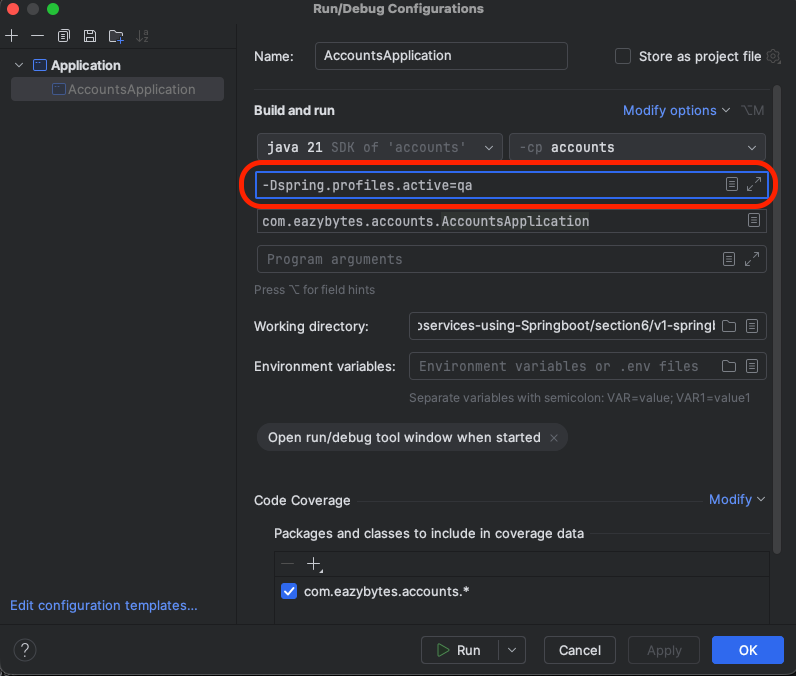
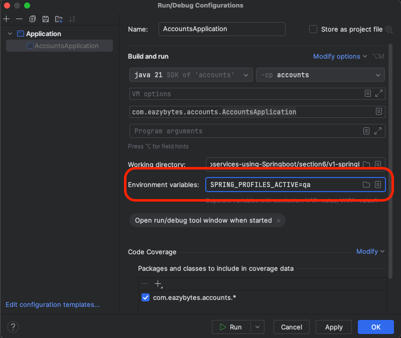

# Microservices-using-Springboot
Microservices using springboot

## Project Structure

### Section 2: Basic Microservices
- Basic Spring Boot project strucuture
- Three independent microservices (Accounts, Cards, Loans)
- Defining entity structure
- Spring Data JPA for database operations, use of in-memory database like H2
- Creating DTOs
- Creating REST controllers
- Service layer implementation
- Repository layer
- Mapper classes for conversion between entity to dto and vice versa
- Exception handling
- Input validation
- Audit columns
- Swagger API documentation

### Section 4: Containerization of services using Docker
- **Three ways of creating docker images**
    - Method 1: Using Dockerfile (Accounts Microservice)
      - Creating jar file using maven command
      - Writing instructions in Dockerfile
      - Generate the docker image
      - Run the docker image

    - Method 2: Using buildpacks (Loans Microservice, but it is NOT WORKING, so temporarily using Google Jib to create the image)
      - Paketo buildpacks (developed by Heroku and Pivotal)
      - No need to worry about the security, performance, compressing of the image...buildpacks handles it
      - Add image instruction in pom.xml
      - Create docker image using : mvn spring-boot:build-image
  
    - Method 3: Using Google Jib (Cards Microservice)
      - Jib builds optimized Docker and OCI images for your Java applications without a Docker daemon - and without deep mastery of Docker best-practices.
      - Can be used to create imges, even if we don't have Docker installed on our local system
      - It is only for Java based project
      - This will be used throughout this course

- **Running the docker images as containers**

    ```bash
    docker run -d -p 8090:8090 ldeepak/loans:s4
    docker run -d -p 8080:8080 ldeepak/accounts:s4
    docker run -d -p 9000:9000 ldeepak/cards:s4
    ```

- **Listing the images**

    
    
- **Listing the containers**

    
  
- **Pushing the docker images to docker repository using Docker desktop UI**
    
    
- **Docker compose**
  To run multi-container applications
    - Create docker-compose.yaml file
    - Run all the containers at once using ```docker compose up``` command

      

      

  - Stop all the containers at once using ```docker compose down``` command

    

### Section 6: Configuration Management in Microservices

- **Challenges:**
  - How do we separate the configuration/properties from the microservices so that the same docker image can be deployed in different environments
  - How do we inject the configuration/properties needed by the microservice during the startup of the service
  - How do we maintain configuration/properties in a centralized repository along with versioning

- **Solutions:**
  - Configuring Spring Boot with properties and profiles
    - Properties:
      - Using @Value Annotation
      - Using Environment interface
      - Using @ConfigurationProperties (RECOMMENDED as it avoids hard coding property keys)
    - Profiles:
      - The default profile is active. But we can create another profiles for each environment and activate it based on our requirements

  - Applying external configuration with Spring Boot
    - Command line arguments:
      - Command-line args are automatically converted to key/value pairs
      - Has Highest precedence
      - Ex: ```java -jar <jar-file-name> --key=value```

        

    - JVM system properties:
      - It is prefixed with -D
      - Lower precendence than the command line args, but greater than application property files
      - Ex: ```java -Dkey=value -jar <jar-file-name>```

        

    - Using Environment variables:
      - Universally supported
      - Lower precedence than the JVM properties, but greater than application property files
      - Ex: ```KEY=value java -jar <jar-file-name>```

        
    

    So the order or precedence is:
    Command line args (Highest) > JVM properties > Environment variables > application property files
    
  - Implementing a configuration server with Spring Cloud Config server

